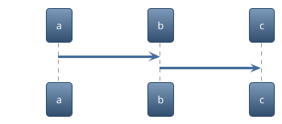

# PlantUML Themes

An overview of all available themes can be seen in the [Theme Gallery](https://bschwarz.github.io/puml-themes/gallery.html).

## Usage
Set a theme



Get all themes with `help themes`

```plantuml
help themes
```

## Links
- [plantuml.com/en/theme](https://plantuml.com/en/theme)